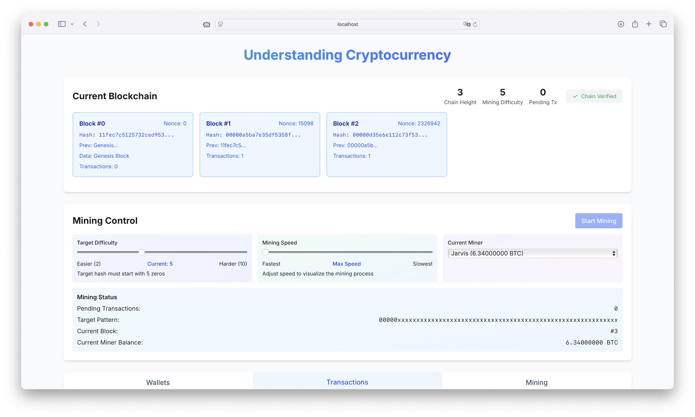

# Cryptocurrency Educational Demo

An interactive web application that demonstrates how cryptocurrency and blockchain technology work through animations and simulations. This application provides a hands-on learning experience for understanding blockchain concepts, cryptocurrency transactions, and mining processes.



## Features

### Blockchain Visualization

- Real-time block creation and chain visualization
- Visual representation of block connections and hash relationships
- Dynamic updates as new blocks are mined

### Mining System

- Real-time mining process demonstration
- SHA-256 hash calculation with adjustable difficulty
- Mining statistics display including:
  - Current hash rate
  - Total hashes computed
  - Recent successful hashes
- Background mining process that continues across UI interactions
- Configurable mining rewards:
  - Adjustable block reward (default: 3.125 BTC)
  - Customizable transaction fee rate
  - Real-time reward calculations

### Miner Management

- Multiple miner support with unique identities
- Default miner (Jarvis) pre-configured
- Easy miner creation and removal
- Individual balance tracking for each miner
- Miner switching during mining operations
- Automatic reward distribution:
  - Block rewards
  - Transaction fees
- Balance history for mining rewards

### Transaction Management

- Transaction pool with real-time updates
- Automatic transaction verification and inclusion in blocks
- Visual representation of transaction status (pending, confirmed, failed)
- Transaction history tracking
- Transaction fees contribute to miner rewards

### Wallet Management

- Built-in wallet system with public/private key pairs
- Default wallets (Alice and Bob) for demonstration
- Ability to create new wallets with custom initial balances
- Secure key pair generation using elliptic curve cryptography (secp256k1)
- Balance tracking and updates based on confirmed transactions

## Getting Started

### Local Development

1. Clone the repository:

   ```bash
   git clone https://github.com/sanpingz/cryptocurrency.git
   cd cryptocurrency
   ```

2. Install dependencies:

   ```bash
   npm install
   ```

3. Run the development server:

   ```bash
   npm run dev
   ```

4. Open [http://localhost:3000](http://localhost:3000) in your browser.

### Production Deployment

1. Build the application:

   ```bash
   npm run build
   ```

2. Start the production server:

   ```bash
   npm start
   ```

### Docker Deployment

1. Build the Docker image:

   ```bash
   docker build -t cryptocurrency .
   ```

2. Run the container:

   ```bash
   docker run -p 3000:3000 cryptocurrency
   ```

## Technology Stack

- Next.js 14 (React Framework)
- React (UI Library)
- TypeScript (Type Safety)
- Framer Motion (Animations)
- TailwindCSS (Styling)
- CryptoJS (Hash Functions)
- Elliptic (Cryptographic Key Generation)
- Web Workers (Background Mining)

## Architecture

The application is built with a modular architecture:

### Core Components

- `BlockchainContext`: Central state management for blockchain operations
- `MiningWorker`: Background process for mining operations
- `WalletManager`: Wallet creation and management interface
- `MinersManager`: Miner creation and management interface
- `TransactionProcessDemo`: Transaction creation and monitoring
- `BlockchainVisualizer`: Visual representation of the blockchain

### State Management

- Centralized state management through React Context
- Real-time updates for mining status and transactions
- Persistent wallet state and transaction history

## Security Features

- Secure key pair generation using secp256k1 elliptic curve
- Transaction validation and verification
- Balance checking before transaction approval
- Protection against double-spending
- Secure wallet management

## Educational Value

This demo helps users understand:

- How blockchain maintains data integrity
- The mining process and proof of work
- Public/private key cryptography
- Transaction verification and confirmation
- Wallet management and balance tracking
- Mining rewards and fee distribution
- Role of miners in blockchain networks

## Contributing

Feel free to contribute to this educational project by submitting pull requests or creating issues for bugs and feature requests.

## License

This project is licensed under the MIT License - see the [LICENSE](LICENSE) file for details.
